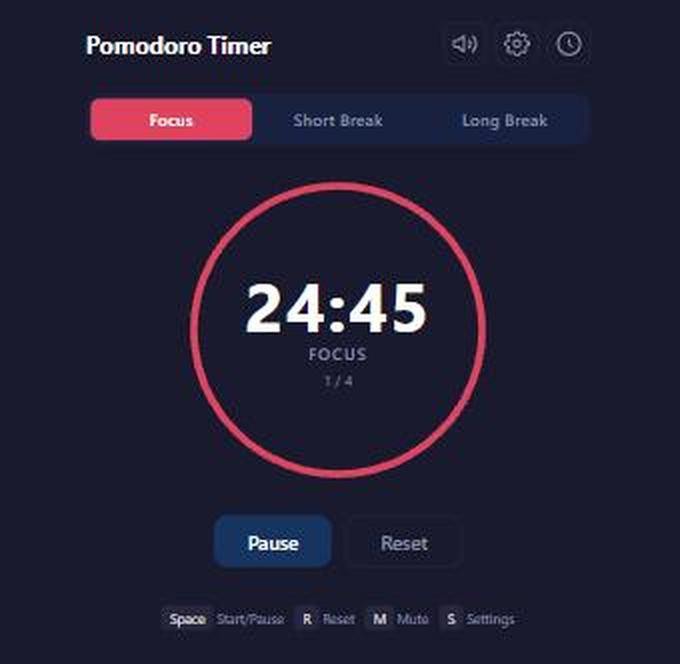

# Pomodoro Focus Timer

A clean, responsive Pomodoro focus timer with customizable intervals, sound notifications and session tracking. Built with vanilla HTML, CSS and JavaScript — no frameworks, no build step, no dependencies.

**[→ Try it live](https://dacheson.github.io/pomodoro-timer/)**



## Features

- **Three timer modes:** Focus (25 min), Short Break (5 min), Long Break (15 min)
- **Auto-advance sessions:** Automatically cycles through Focus → Short Break → Long Break
- **Customizable durations:** Adjust focus, short break, long break lengths and long break interval
- **Auto-start options:** Optionally auto-start breaks and/or focus sessions
- **Sound notifications:** Web Audio API–generated chimes when sessions end (no external files)
- **Mute toggle:** Silence notifications with one click; preference persisted
- **Session history:** Track completed sessions with today's stats and a scrollable log
- **localStorage persistence:** Settings, mute state, and session history survive page reloads
- **Dark theme:** Calm, focused aesthetic with a large central timer and SVG progress ring
- **Responsive design:** Works on desktop and mobile (down to 320px)
- **Keyboard shortcuts:** Space (start/pause), R (reset), M (mute), S (settings)
- **Accessible:** ARIA labels, live regions, and full keyboard navigation

## Running locally

No tooling required — the app is three static files.

```bash
git clone https://github.com/dacheson/pomodoro-timer.git
cd pomodoro-timer
python -m http.server 8000   # or: npx serve .
```

Then open <http://localhost:8000>.

## Project structure

```
index.html    markup, timer ring, settings and history panels
style.css     dark theme, layout, responsive rules
script.js     timer state machine, Web Audio chimes, localStorage
```

## Deployment

Deployed to GitHub Pages by the workflow in `.github/workflows/`, which publishes the repository root on every push to `main`. No build step runs.

## Licence

[MIT](LICENSE)
